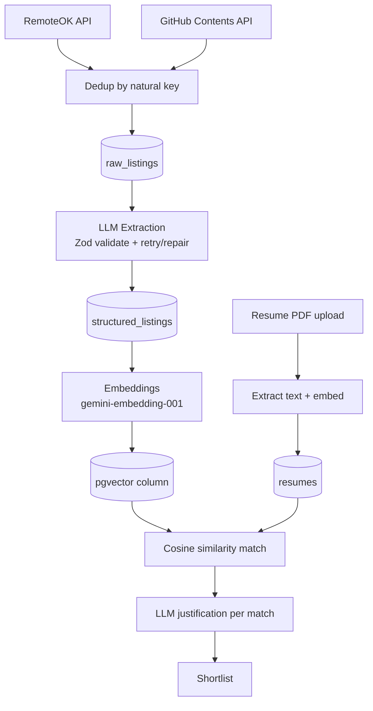

# NEXUS: Autonomous Career Intelligence Agent

Full-stack pipeline that scrapes job/internship listings, structures them with an LLM,
matches them semantically against a user's resume, and lets users save results to a
personal shortlist. Built for the AI & Software Guild Software Development recruitment.

## Live Deployment

- **Frontend**: https://nexus-hazel-rho.vercel.app/
- **Backend API**: https://nexus-backend-41hg.onrender.com/

Backend is deployed on Render (Web Service + managed Postgres with `pgvector`), frontend on Vercel.
Production is seeded from the same dataset used in local development (see "Data" below). It does
not start from an empty database.

> **Note:** the backend runs on Render's free tier, which spins down after periods of inactivity.
> The first request after idling may take up to ~30-60 seconds to respond while it wakes up. This is
> a platform limitation of the free tier, not an application bug.

## Setup (local development)

### 1. Postgres

Install locally, create a database and user, enable `pgvector`:

```bash
sudo apt install postgresql postgresql-contrib postgresql-<version>-pgvector
sudo -u postgres psql
```

```sql
CREATE DATABASE nexus;
CREATE USER nexus_user WITH PASSWORD '<your-password>';
GRANT ALL PRIVILEGES ON DATABASE nexus TO nexus_user;
\c nexus
GRANT ALL ON SCHEMA public TO nexus_user;
CREATE EXTENSION IF NOT EXISTS vector;
```

### 2. Install dependencies

```bash
npm install
```

### 3. Environment variables

Create a `.env` file in the project root:

```
DATABASE_URL=postgresql://nexus_user:<password>@localhost:5432/nexus
GITHUB_TOKEN=<personal access token, no scopes needed, used only to raise the read rate limit on public repo content>
GEMINI_API_KEY=<your Gemini API key>
GROQ_API_KEY=<your Groq API key, used for LLM extraction - optional, we can use same gemini key>
JWT_SECRET=<random 32-byte hex string>
PORT=3000
FRONTEND_URL=<your deployed frontend URL, for CORS - Omit or use * for local dev>
```

Generate a `JWT_SECRET` with:

```bash
node -e "console.log(require('crypto').randomBytes(32).toString('hex'))"
```

### 4. Initialize the schema

```bash
node tools/migrate.js
```

### 5. Run the pipeline

Each script is independently re-runnable and safe to repeat, nothing gets duplicated or
reprocessed unnecessarily.

```bash
node run-scrapers.js       # scrapes RemoteOK + GitHub, dedupes, persists
node run-extraction.js     # LLM-structures pending raw listings
node run-embed-listings.js # generates embeddings for structured listings
```

### 6. Start the server

```bash
node server.js
```

### 7. Frontend

```bash
cd frontend
npm install
npm run dev
```

Runs on `http://localhost:5173` by default; set `VITE_API_URL` in `frontend/.env` to point
at your backend (`http://localhost:3000` locally, or the deployed backend URL).

## Data

The dataset backing this project was built once via the pipeline above: 1683 listings scraped
from two sources, all 1683 successfully passed LLM structured extraction, and all embedded for
semantic search. The production deployment was seeded from a `pg_dump`/`pg_restore` of this same
dataset rather than starting empty, so the live demo reflects real, fully-processed data rather
than a fresh/empty database.

## Architecture


**Auth & multi-tenancy:** email/password, bcrypt-hashed, JWT-based sessions. Every user-scoped
table (`resumes`, `shortlist`) carries a `user_id` foreign key, and every query is explicitly
filtered by the authenticated user's ID taken from the verified JWT, never from a client-supplied
ID in the URL or request body. This is enforced at the application layer (every query includes
`WHERE user_id = $1`) rather than via Postgres row-level security policies, a deliberate scope
decision given the project timeline; RLS would be the natural hardening step for a production
version, since it enforces isolation at the database level regardless of application code
correctness.

## Deduplication strategy

Each source has a **natural key**, a value the source itself treats as unique, rather than a
hash of content:

- **RemoteOK**: the job's own numeric `id` field, confirmed unique across a full scrape.
- **GitHub** (Simplify internships repo): the listing's `job_url` (apply link), confirmed unique
  across all rows in the source README.

On each scraper run, new records are compared against what's already stored by natural key:

- No match found → inserted as new.
- Match found, but content differs (title, location, flags, etc. excluding volatile fields
  like `scraped_at`) → treated as an edit; the existing row is updated in place and its
  `extraction_status` is reset to `'pending'` so it gets re-extracted.
- Match found, content identical → skipped.

This also serves as basic change detection for free. A `UNIQUE (source, natural_key)` constraint
on `raw_listings` enforces this at the database level as a safety net against application-level
bugs.

## What's unfinished

- **The Agent (tool-calling chat interface)**: not implemented. Planned approach: an Express
  route accepting a chat message, using an LLM's function-calling API with at least three tools
  (e.g. `getShortlistedListings`, `getUpcomingDeadlines`, `getSkillFrequency`), each backed by a
  parameterized query scoped to the authenticated user, never a raw dump of rows into the
  prompt. The frontend has a placeholder page for this.
- **Video Briefing**: not implemented. Planned approach: an LLM-written 60–90s script from the
  user's top 3 matches, sent to a video/TTS API, with a `briefings` table tracking job status
  (`queued`/`processing`/`done`/`failed`) polled asynchronously by the frontend rather than
  blocking a request thread. The frontend has a placeholder page for this.